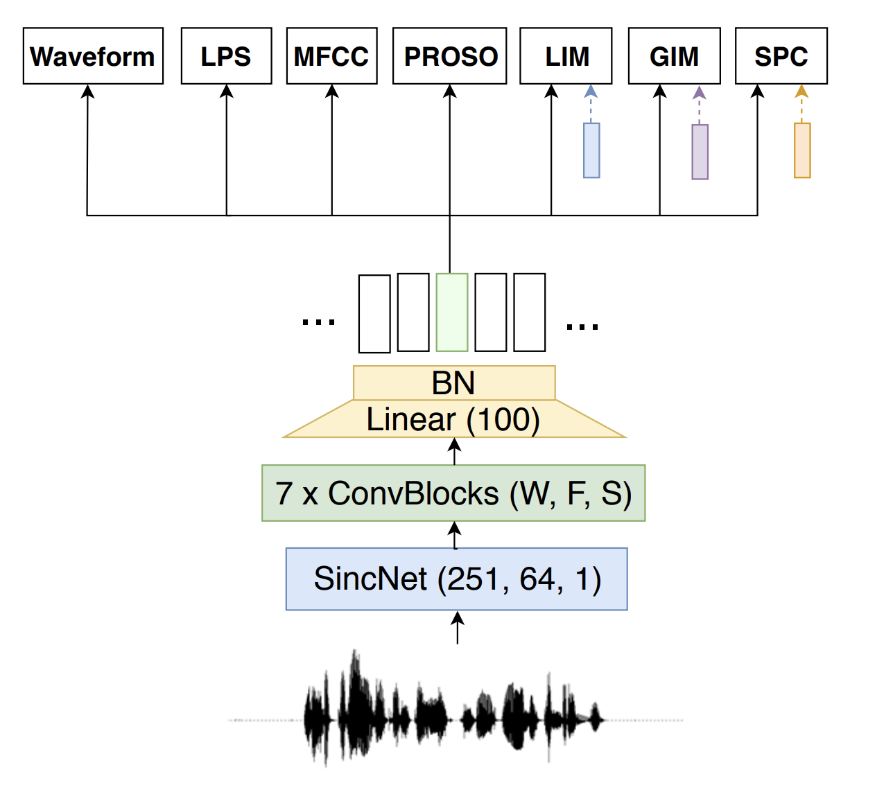

## Methods for Self-Supervised Learning

### Contrastive Learning
Contrastive learning is a method that describes learning representations by modeling similarity from natural variations of data.
It is often presented in the following stages:
1. Encode different "views" from natural variations of a single example.
2. Train a model with metric learning using the representations from the encoder(s).
3. Use the representation of the encoder by applying another classifier for the downstream task. For evaluation, linear regression is used usually so that we can focus on the performance of the pre-trained encoder rather than the that of the added classifier.


### Contrastive Predictive Coding
Contrastive predictive coding (CPC) was introduced by Aäron van den Oord et al. (2018) {cite}`oord2018representation` as a universal framework of representation learning. The data can be an image, in which neighbouring *patches* usually share spatial information locally. In the case of speech signals, it could be the phonemes that should be similar with the neighbors. Conversely, on a more global level, we expect a different pattern. For example, the chorus of a song is expected to repeat in another part of our audio signal. 

In CPC, these related observations are mapped similarly as a representation in a latent space. Their hypothesis is that predictions of related observations are often conditionally dependent on similar, high-level pieces of latent information.

To test their hypothesis, they propose the following:
1. First, complex natural data, such as images and audio, are compressed into a latent embedding space. This makes it easier to model the predictions of related observations.
2. A more expressive *(read: larger, more powerful)* autoregressive model uses the representations in this latent space to make predictions for future observations. These observations are mapped to the corresponding representation. 
3. The InfoNCE loss uses a cross-entropy loss to quantify how well the model can classify these future representations from a set of unrelated, *"negative"* examples [CITATION]. This loss is inspired by Noise Contrastive Estimation [CITATION].


```{admonition} Mini-batch composition
:class: tip
In CPC, a mini-batch is made of $N$ examples that are chosen randomly from the full training dataset. Within this batch, a single positive example (also known as the *anchor* sample) and $N-1$ negative examples are used to compute the cross-entropy loss for classifying the correct positive example. In this way, the internal structure of the data is leveraged to obtain a loss signal that we can backpropagate.
```

### Momentum Contrast (MoCO)
Momentum Contrast was proposed in {cite}`he2020momentum`. It was one of the first papers to close the gap between unsupervised and supervised learning approaches on some vision tasks. In MoCO, a dictionary of examples in the data are maintained as a queue. Each example in the mini-batch is encoded, and put in front of the queue, while the last item in the dictionary is subsequently dequeued. The pretext task used in MoCO is to define a contrastive loss on the query and the keys of the dictionary: a query matches the key when the query is an embedding of a different *view* of the same datapoint. For example: if the query is an embedding of the bassoon solo in Stravinsky's "Rite of Spring", it should match with the key that corresponds to the "Rite of Spring". The encoded query should be similar to its corresponding key, and dissimilar to other keys in the dictionary.


Training a Momentrum Contrast encoder is done with positive and negative pairs of examples in a mini-batch. The positive example pairs are made of queries that correspond to keys of the current mini-batch. The negative pairs are queries of the current mini-batch and keys from past mini-batches.


```{image} ../../book/images/janne/momentum_contrast.png
:alt: Momentum Contrast training protocol (From Momentum Contrast for Unsupervised Visual Representation Learning (2019)
:width: 400px
:align: center
```


The keys are encoded by a *"slowly progressing"* encoder, because the dictionary's keys are drawn over multiple mini-batches. This encoder is implemented as a momentum-based moving average. We therefore have two encoders: an encoder for the queries and a momentum-encoder for the keys. The main difference between these two encoders is in the way they are updated. The query encoder is updated by backpropagation while the momentum encoder is updated by a linear interpolation of the query and the momentum encoder.


```{admonition} Tip
:class: tip
An advantage of Momentum Contrast is that the batch size is not related to the number of negative examples candidates in the dictionary lookup. Even for smaller batch sizes, the performance of Momentum Contrast is consistent. This can be especially useful for (raw) audio, for which it is often harder to compute with larger mini-batch sizes due to GPU memory constraints.
```


### SimCLR
SimCLR was introduced in {cite}`chen2020simple` as a simple contrastive learning approach to learn strong visual representations. It leverages strong image data augmentations, large batch sizes, a single large encoder and a simple contrastive loss to pre-train an encoder that learns effective representations. These representations are used to train very effective linear classifiers in various downstream image classification tasks.

For each image example in the mini-batch, two augmented (but correlated!) views are taken. This is done by a series of data augmentations that are applied randomly to each example. This will naturally yield $2N$ datapoints per mini-batch. Each of these augmented views are then embedded using a standard ResNet encoder network. While these representations are used during linear evaluation, during the pre-training stage these representations are projected to a different latent space by a small linear layer on which the contrastive loss is computed.

During pre-training, the network only learns from the contrastive loss: the labels are only used during the linear evaluation phase (see the previous section for more details).

```{image} ../../book/images/janne/simclr_contrastive_learning.png
:width: 400px 
:align: center
```


### Contrastive Losses

```{image} https://i.imgur.com/2uZeF4U.png
:alt: Figure 1 from "Improved Baselines with Momentum Contrastive Learning" (Chen et al., 2020)
:width: 600px 
:align: center
```

Many contrastive learning methods use a variant of a contrastive loss function. The contrastive loss function was first introduced in Noise Contrastive Estimation {cite}`gutmann2010noise` and subsequently the InfoNCE loss from Contrastive Predictive Coding {cite}`oord2018representation`.

This loss can be minimized using a variety of methods, which mostly differ in the way they keep track of the keys of data examples. In SimCLR {cite}`chen2020simple`, a single batch consists both of "positive" and "negative" pairs, which act as "keys" to the original examples. These are updated end-to-end by back-propagation. To increase the complexity of the contrastive learning task, it requires a large batch size to contain more negative examples. In Momentum Contrast, the negative examples' keys are maintained in a queue. Note that only the queries and the positive keys in a single batch are encoded.


```{image} ../../book/images/janne/equation_1.png
:width: 400px 
:align: center
```


### PASE
PASE was proposed in {cite}`pascual2019learning`. It demonstrated that useful representations for speech recognition can be learned by defining multiple pretext tasks that jointly optimize an encoder neural network. The encoder distributes the representations of the input data to multiple, small feed-forward neural networks (called *workers*) that jointly solve different pretext tasks. Each worker is composed of a single hidden layer, and either solves a regression or binary classification task. These smaller feed-forward layers are chosen because the emphasis on learning the more expressive representations is put on the larger encoder, i.e., the encoder should learn more high-level features that can be used by the *worker* networks to help solve their tasks. After pre-training the network in a self-supervised manner, the learned representations are evaluated in the task of speaker recognition, emotion recognition and phoneme recognition.



The improved version of PASE, which was called PASE+, uses a set of audio data augmentations to improve the robustness of the learned representations for the downstream task.
### More papers on self-supervised learning
The following is a short list of important papers in self-supervised learning, of which a few are discussed more in-depth in this tutorial:

| Paper  | Year  | Tasks |
|---|---|---|
| [Representation Learning with Contrastive Predictive Coding](https://arxiv.org/abs/1807.03748)  | 2018  | Speech, images, text, reinforcement learning | 
| [Noise-contrastive estimation: A new estimation principle for unnormalized statistical models](https://proceedings.mlr.press/v9/gutmann10a/gutmann10a.pdf) | 2014 | Theoretical |
| [Unsupervised Visual Representation Learning by Context Prediction](https://arxiv.org/abs/1505.05192)  | 2015  | Images |
| [Momentum Contrast for Unsupervised Visual Representation Learning](https://arxiv.org/abs/1911.05722)  |  2019 |  Images |
| [wav2vec: Unsupervised Pre-training for Speech Recognition](https://arxiv.org/abs/1904.05862) | 2019 | Speech recognition |
| [Learning Problem-agnostic Speech Representations from Multiple Self-supervised Tasks](https://arxiv.org/abs/1904.03416) | 2019 | Speech recognition |
| [Bootstrap your own latent: A new approach to self-supervised Learning](https://arxiv.org/abs/2006.07733)  | 2020  | Images |
| [A Simple Framework for Contrastive Learning of Visual Representations](https://arxiv.org/abs/2002.05709)  | 2020 | Images  |
| [Contrastive learning of general-purpose audio representations](https://arxiv.org/abs/2010.10915) | 2020 | Sound classification |
| [Contrastive Learning of Musical Representations](https://arxiv.org/abs/2103.09410) | 2021 | Music classification |
| [Vector Quantized Contrastive Predictive Coding for Template-based Music Generation](https://arxiv.org/abs/2004.10120) | 2021 | Music generation |

