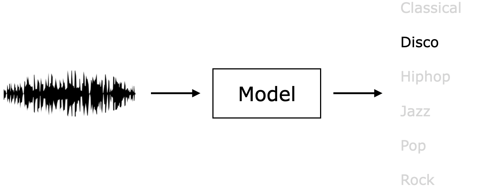
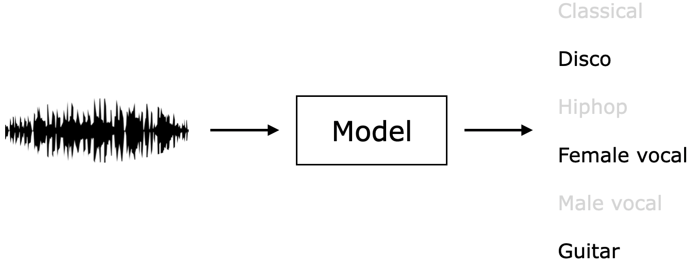
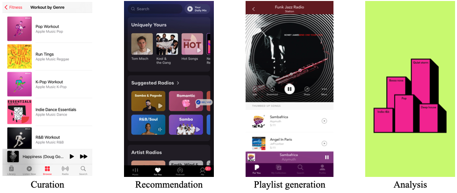

# What is music classification?

Music classification is a music information retrieval (MIR) task whose objective is computational understanding of music semantics. For a given song, a variety of music information can be retrieved in the task -- from genre, mood, and instrument to broader concepts including music similarity and musical preferences. Retrieved information can be further utilized for music curation, recommendation, and semantic search. 

### Single-label classification
Let's say there are two record stores in your town. Record store A curates all the records in an alphabetic order while record store B categorizes their stocks based on musical genres. When you already know what you want to buy, record store A is a good place to go. However, when you want to browse and discover new music, record store B will be more preferable. Like this, well-designed categorization (i.e., music classification) helps customers browse music in a more efficient manner. This record store scenario can be interpreted as a single-label classification task. One item can be in a single section, hence categories (genres in this example) are exclusive to each other.

<!--For curation, categorization, recommendation.
Automatic music classification is gaing more attention than ever from both academia and industries due to its suitability for scalable research and its practical applications in music recommendation services from large-scale libraries.
-->

Single-label classification

### Multi-label classification
Different from the aforementioned example, one item may belong to multiple categories. For example, one song can be Disco and K-Pop at the same time and these categories are not exclusive to each other. Also, not only music genres, listeners would like to browse music also by instruments, moods, or context. We can handle these multiple musical attributes with multi-label classification. The multi-label classification sometimes refers to as "music tagging" since it puts multiple appropriate tags for a given song. 

Multi-label classification

Music tagging is a multi-label binary classification task. For each tag, the system determines whether a given song is positive to the tag or not. In contrast with single-lable classification, tags are not exclusive to each other and multiple tags can exist together.

### Music classification tasks
Based on desired categories, there can be almost infinite number of music classification tasks. Among them, the most explored music classification tasks in MIR research are listed as follow:

- Genre classification [reference]
- Mood classification [reference]
- Instrument identification [reference]
- Music tagging [reference]

Note that music tagging subsumes all other classification tasks as any classification categories can be music tags.

### Applications
Music classification models can be utilzied to enhance many music applications including curation, semantic search, recommendation, playlist generation, and analysis of listening behaviour.

Applications of music classification. Screenshots captured from Apple music, Resso, Pandora, and Spotify

<!--- Curation
- Semantic search
- Content-based recommendation
- Playlist generation
- Analysis

-->