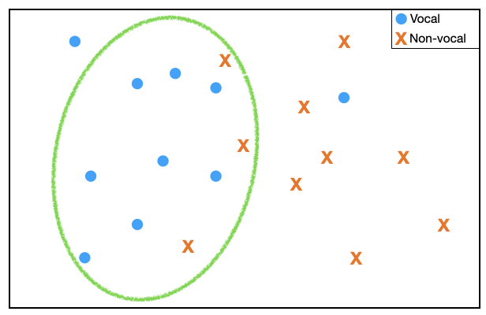
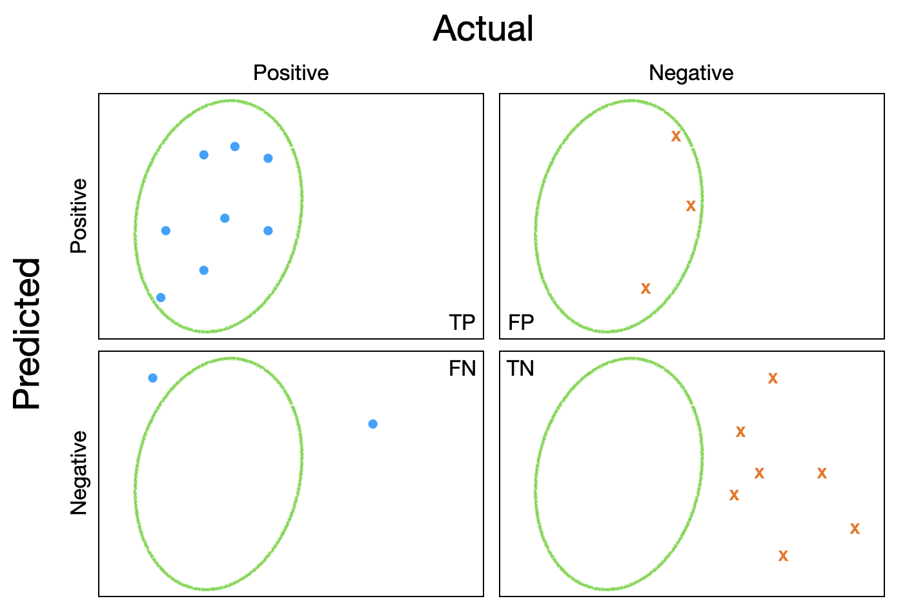
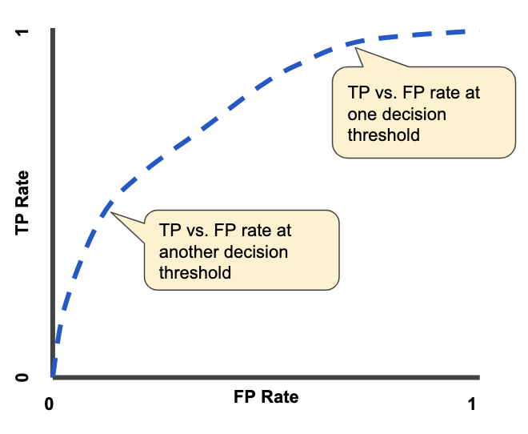
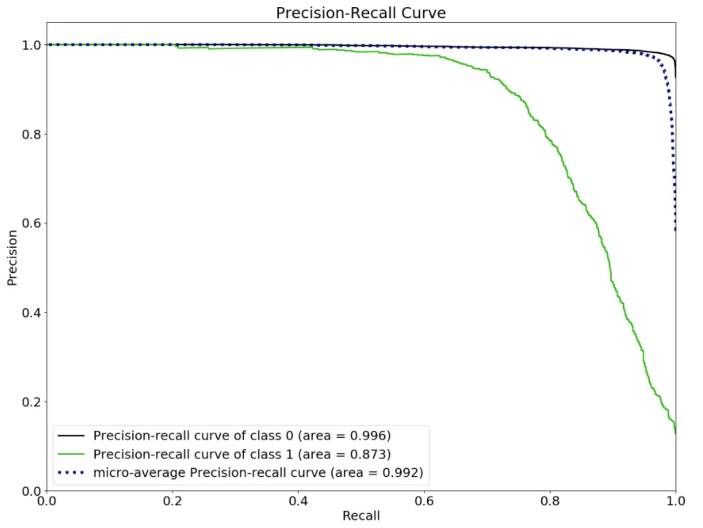

# Evaluation

@minz

<!--How can we properly assess the performance of music classification models? This section instroduces broadly used evaluation metrics in music classification and discusses when to apply those metrics.
-->
<!--** Figures need to be created by myself again **-->

We want to assess a classifier that detects vocals in music. In our dataset, we have 10 songs with vocal and 10 songs without vocal. The green circle is a decision boundary of the model. The model predicted the items in the circle are vocal music and the items at the outside of the circle are instrumental music.

As shown in the figure below, we can separate the predictions into four categories. 

- True positives (TP): First row, first column. Correctly predicted vocal songs.
- False positives (FP): First row, second column. Predicted as vocal music but they are not.
- False negatives (FN): Second row, first column. Predicted as non-vocal but they are vocal music.
- True negatives (TN): Second row, second column. Correctly predicted non-vocal songs.

### Accuracy
Accuracy is one of the most intuitive evaluation metrics that we can use to evaluate classification models. It measures how many predictions are correct and the formula of accuracy is:

The accuracy of the vocal / non-vocal classification model is (8 + 7) / 20 = 0.75.

### Precision
Precision measures how many retrieved items are truly relevant. Among 11 retrieved items in the green circle, 8 of them are vocal music and 3 of them are not. The formula of precision is:

hence the precision of the model is 8 / (8 + 3) = 0.73. Precision is also known as positive predictive value.

<!--When we build a query-by-tag music search system, for example, precision is an important evaluation metric since we want the result to be precise. However, 
-->

### Recall
Recall measures how many relevant items are correctly retrieved. Among 10 songs with vocal, 8 of them are correctly predicted as vocal music. The formula of recall is:

hence the recall of the model is 8 / (8 + 2) = 0.8. Recall is also known as sensitivity or true positive rate. And the opposite term is specificity or true negative rate: how many rejected items are truly negative, i.e., TN / (FP + TN).

### High precision vs high recall?
The model outputs likelihood of the input to have vocal between 0 and 1. With a high threshold, the green circle becomes smaller and the precision of the model becomes higher. When user queries "vocal music", the resulted items will be reliable. However, if the threshold is too high, although the model shows high precision, the recall will become lower since the model will reject less confident items. As a result, only few vocal music will be introduced to users while other songs to be discarded. On the other hand, when threshold is too low, recall gets closer to 1 while precision goes lower. Hence, appropriate decision making of threshold is important.

### ROC AUC
To consider the characteristics of the model varied by thresholds, we can use receiver operating curve. 

Based on the threshold, the performance of model can be changed. By modifying the threshold we can get receiver operating curve. The area under the curve. It's 0.5 when it's random. It's 1.0 when it's a perfect system.

An ROC curve (receiver operating characteristic curve) is a graph showing the performance of a classification model at all classification thresholds. This curve plots two parameters:

True Positive Rate
False Positive Rate
True Positive Rate (TPR) is a synonym for recall and is therefore defined as follows:

False Positive Rate (FPR) is defined as follows:

An ROC curve plots TPR vs. FPR at different classification thresholds. Lowering the classification threshold classifies more items as positive, thus increasing both False Positives and True Positives. The following figure shows a typical ROC curve.

Fig.3 - Precision and recall

### PR AUC
Let's say a tag "clarinet" is very rare in our dataset. The model simply ignores the tag and predict all values to be "non-clarinet". In this case, ROC-AUC score will be over optimistic. To alleviate this issue, we use PR AUC.

Fig.3 - Precision and recall

