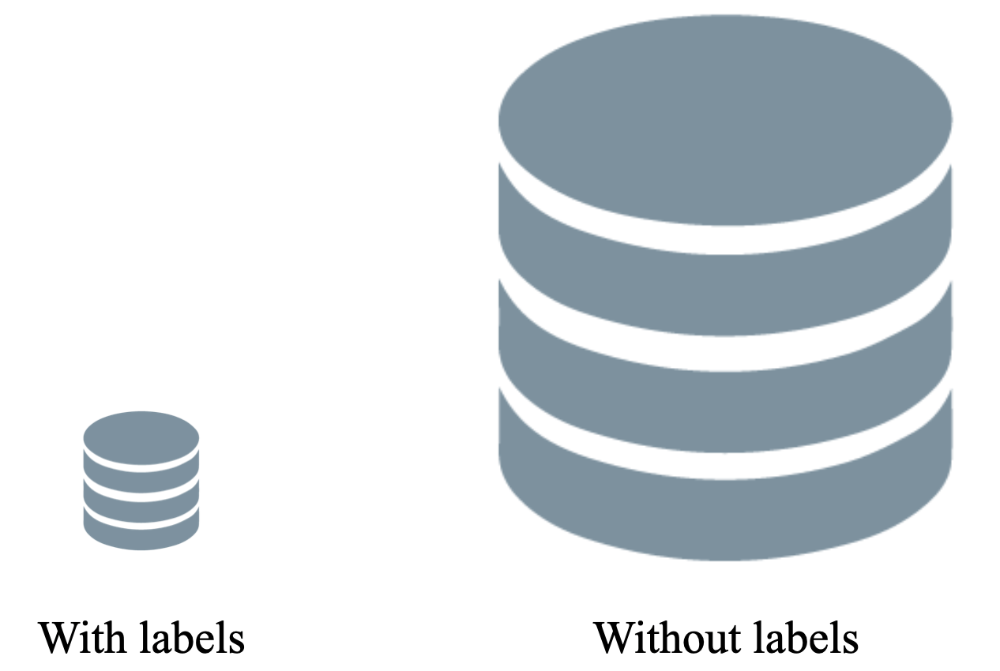

# Introduction

@minz

We designed music classification models to save the effort of manually annotating musical attributes. However, modern deep learning models are data-hungry. As a result, ironically, human annotators need to label more data to train a better model. In this section, we are going to explore training methods that we can choose instead of manually labeling more data, when we do not have enough annotations. 

In a real-world scenario, we have a large-scale music library and only few of them are labeled. In supervised learning scenario, we train our model with the labeled data and we expect the trained model can generalize to the entire data that we have. To tackle the issue of limited amount of annotations, transfer learning takes advantage of other labeled data and semi-/self-supervised approaches utilize abundant unlabeled data. Let's check the motivation, concepts, and implementation of each approach.